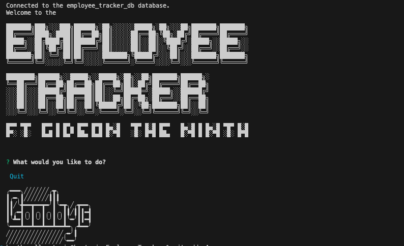
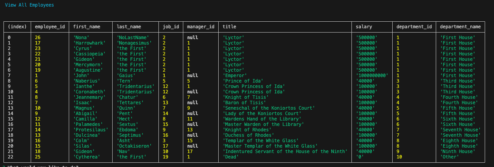

<h1 style= "text-center"> Employee Tracker </h1>
 

  

  ## Table of Contents
<ol>
<li>
<a href="#description"> Description </a>
</li>
<li> <a href="#built-with"> Built With </a>
</li>
<li><a href="#installation"> Installation </a>
</li>
<li>
<a href="#usage"> Usage </a>
</li>
<li><a href="#contributions"> Contributions </a>
</li>
<li>
<a href="#testing"> Testing </a>
</li>
<li>
<a href="#license"> License </a>
</li>
<li>
<a href="#contact"> Contact </a>
</li> 
</ol>

## Description 
 
  A terminal application to view and manage employee information
 

### Built With: 

  
  

## Installation 
 
   needs to be run in the terminal. Uses Express, Inquirer@8.2.4 and psql 

## Usage 

1. Clone the repo from github (link in the contact section) 
2. Run "node index.js" in the terminal

Below are Videos and Photos of the app in action.

  

  []
  []

**Additional Usage Info:** 
   n/a

## Testing 

  n/a

## Contributions 

   Contributions are what make the open source community such an amazing place to learn, inspire, and create. Any contributions you make are **greatly appreciated**. 

If you have a suggestion that would make this better, please fork the repo and create a pull request. You can also simply open an issue with the tag "enhancement".

Don't forget to give the project a star! Thanks again!

1. Fork the Project
2. Create your Feature Branch (git checkout -b feature/AmazingFeature)
3. Commit your Changes (git commit -m 'Add some AmazingFeature')
4. Push to the Branch (git push origin feature/AmazingFeature)
5. Open a Pull Request

 
 **Additional Contribution Details:** 
   n/a

## License 
 
  This project is licensed under MIT License. For more information please click on the badge below: 
  
 
 

## Contact 
 
**For Questions, please reach out to me on Github or by Email** 

  - Github: 
   [hestrain](https://github.com/hestrain)

  - Email Address: 
  [hestrain@gmail.com](mailto:hestrain@gmail.com)

  ### Project Links: 

 - [Github Repository](https://github.com/hestrain/Employee-Tracker)

 - [Deployed Site](n/a)